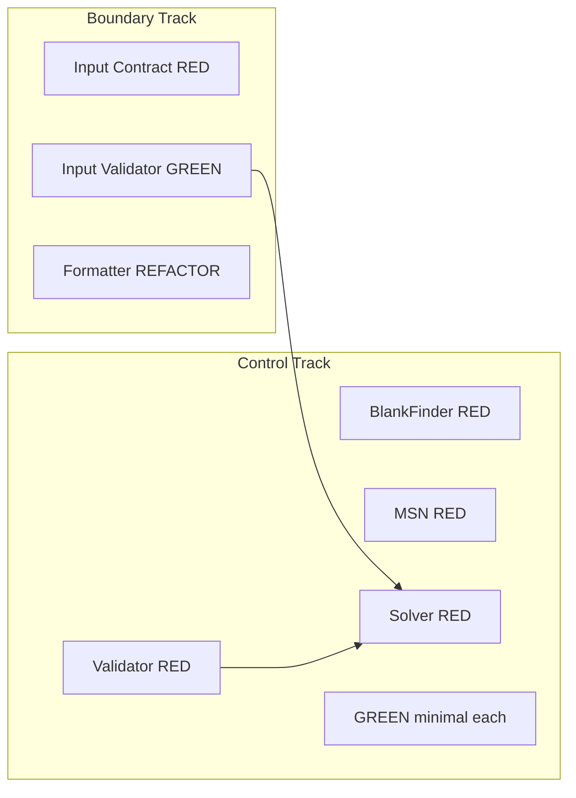

# Magic Square 4×4 — Product Requirements Document (PRD)

| 항목 | 내용 |
|---|---|
| **문서 ID** | PRD-MSQ-001 |
| **버전** | 1.0 |
| **상태** | Approved for Implementation |
| **작성일** | 2026-05-29 |
| **선행 문서** | `Report/08-prd-reference-document-analysis.md`, `Report/07-user-journey.md`, `Report/01-problem-definition-report.md` |
| **대상 독자** | 개발자, QA, 교육 설계자, 코드 리뷰어 |

---

## 1. 한 줄 요약 (TL;DR)

4×4 Magic Square를 매개로 **불변식 선언 → 계약 명세 → Dual-Track TDD → 구현 → 리팩토링** 흐름을 훈련하는 Python 라이브러리/CLI 제품이다. v1의 핵심 기능은 **빈칸 2개가 있는 부분 격자를 입력받아 마방진을 완성하고 `[r1,c1,n1,r2,c2,n2]`를 반환하는 Solver**이며, ECB(Clean Architecture)로 Boundary·Control·Entity를 분리하고 모든 요구사항은 테스트로 추적 가능해야 한다.

---

## 2. 배경 / 문제 정의

### 2.1 전통적 알고리즘 훈련의 한계

많은 학습 경로가 "정답 코드를 빨리 만드는 것"에 초점을 맞춘다. 그 결과 설계자는 다음을 약하게 훈련한다.

- 성공 기준을 구현 전에 선언하는 능력
- 행·열·대각선·구성 조건을 **독립적으로** 열거하는 능력
- 생성·검증·표현 책임을 분리하는 능력

### 2.2 표면 문제 정의 (거부)

> "1부터 16까지 숫자를 4×4에 배치해 행·열·대각선 합이 같아지는 마방진을 **만드는** 프로그램"

이 정의는 목적·성공 기준·검증 책임·해 공간(880개)을 은폐하며, 구현이 목적으로 위장한다.

### 2.3 개선된 문제 정의 (정본)

> **4×4 격자에서 제약 조건을 만족하는 상태가 존재하는지 판단하고, 그 상태를 생성·검증·표현하는 책임을 분리하여 다룰 수 있는가.**

v1은 이 정의의 **실습 단위**로, "2칸 빈칸 퍼즐 완성(Solver)"을 구현한다. 완성형 격자에 대한 `generate` / `validate` / `display`는 **Phase 2**에서 동일 불변식 체계로 확장한다.

### 2.4 4×4를 선택한 이유

| 크기 | 특성 | 본 프로젝트 적합성 |
|---|---|---|
| 3×3 | 해가 본질적으로 1개 | 학습 가치 제한 |
| **4×4** | 해 880개, 10개 독립 검증 조건, Magic Constant 유도 | **최적** |
| 5×5+ | 상태 공간 과대 | 분석·훈련 부적합 |

**핵심 수치:** 탐색 공간 16! ≈ 2.09×10¹³ · 유효 해 880개(회전·반사 제외) · Magic Constant = 4×(16+1)/2 = **34**

---

## 3. 목표 (Goals) / 비목표 (Non-Goals)

### 3.1 Business Goal

소프트웨어 설계자가 "어떻게 만드는가"보다 **"무엇이 참이어야 하는가"**를 먼저 사고하는 훈련 환경을 제공한다. 산출물은 실행 가능한 코드와 **계약을 보호하는 테스트 스위트**이다.

### 3.2 Learning Goals

| ID | 목표 | v1에서의 검증 |
|---|---|---|
| L1 | 불변식 중심 설계 | Level 0~3 Invariant 문서화 + 테스트 매핑 |
| L2 | Dual-Track TDD | Boundary Track / Control Track 분리 RED→GREEN |
| L3 | 입출력 계약 명확화 | §6.1 Contract + AC 기반 테스트 |
| L4 | 설계 흐름 체화 | Contract → Test List → Implement → Refactor 마일스톤 |
| L5 | 추적 가능성 | §6.9 Traceability Matrix 유지 |

### 3.3 In Scope (v1.0)

| 우선순위 | 범위 |
|---|---|
| **P0** | 부분 격자(빈칸 2개) 입력 검증 — Boundary |
| **P0** | BlankFinder, MissingNumberFinder, MagicSquareValidator, Solver — Control |
| **P0** | Entity 상수(`GRID_SIZE`, `MAX_VALUE`, `MAGIC_CONSTANT` 유도) |
| **P0** | Dual-Track TDD: Boundary 테스트 / Control 테스트 분리 |
| **P0** | 회귀 시나리오: `07` Level 4 + §13-K 갭 보완 목록 |
| **P1** | 최소 CLI 진입점 (`solve` — 행렬 입력 → 결과 출력) |
| **P1** | Boundary `formatter` — 격자/결과 문자열 표현 (검증·생성 로직 없음) |
| **P1** | `User` 엔티티 유지·문서 정합 (`03`, `04` — Solver 경로와 비연동) |
| **P2** | TDD 설계 문서 `Report/tdd-design-document.md` 정식화 |

### 3.4 Out of Scope (v1.0)

- 웹 UI, GUI 프레임워크, REST/GraphQL API
- 880개 해 열거·대칭 분류 연구
- 3×3 / 5×5 확장
- DB·세션·인증·비밀번호
- 성능 최적화(병렬 탐색, 메모리 튜닝) — 정확성·계약 우선
- 배포 파이프라인·운영 모니터링
- `Submission` / 해 이력 엔티티 (Phase 3 후보)

### 3.5 Product Scope Decision (확정)

본 PRD 작성 시 `08` §7에서 식별된 충돌에 대해 다음을 **확정**한다.

| 결정 ID | 주제 | 확정 내용 |
|---|---|---|
| **D-01** | v1 Primary Feature | **Partial Puzzle Solver** (2 blanks, `int[6]` 출력). Classic `generate/validate/display`는 **Phase 2**. |
| **D-02** | Level 0 이중 정의 | **L0-P**(Partial): 4×4, 값 0\|1~16, 빈칸 정확히 2, 0 제외 중복 없음. **L0-C**(Complete, Phase 2): 1~16 각 1회, 빈칸 없음. |
| **D-03** | Validator 레이어 | `MagicSquareValidator` = **Control**. Boundary는 입력 형식만 검증. |
| **D-04** | 모듈 구조 | `.cursorrules` **ECB 디렉터리** (`entity/`, `control/`, `boundary/`) 정본. |
| **D-05** | 커버리지 | **Control 레이어 ≥ 95%**, **프로젝트 전체 ≥ 80%**. |
| **D-06** | 좌표 기준 | Control 내부 **0-index**. Boundary/Solver 최종 출력만 **1-index** (`+1` 변환은 Boundary 책임). |
| **D-07** | 오류 정책 | Boundary: `InputValidationError`(ValueError 하위). Solver 무해: `NoSolutionError`. Domain 내부: `TypeError`/`ValueError` 표준 사용. |
| **D-08** | User 엔티티 | **P1 유지** — 이미 구현된 Identity-1~7 유지. Solver v1 플로우에는 미포함. |
| **D-09** | CLI | **P1 In Scope** — "웹/GUI/API" Non-Scope와 무관한 **로컬 CLI**만 해당. |
| **D-10** | User Story 정본 | `07` Level 3 **US-01~US-05** 채택. |

---

## 4. 대상 사용자 / 페르소나

### 4.1 사용자 세그먼트

| 세그먼트 | 설명 | 핵심 니즈 |
|---|---|---|
| **Primary** | TDD를 배웠으나 설계·계약으로 연결 못 한 주니어~미드 개발자 | RED→GREEN→REFACTOR를 계층별로 연습 |
| **Secondary** | 불변식/DDD를 이론으로만 접한 개발자 | 실행 가능한 Invariant↔Test 추적 |
| **Tertiary** | 팀 리드·교육 담당자 | 리뷰·성공 기준·금지 패턴이 명문화된 기준 |

### 4.2 Learner Persona — "민지"

| 속성 | 내용 |
|---|---|
| 역할 | 백엔드 주니어, pytest 경험 있음 |
| 목표 | "정답 코드"가 아니라 계약 기반 TDD 습관 형성 |
| 불안 | 테스트를 먼저 쓰면 방향을 잃을 것 같음 |
| 성공 상태 | 실패 테스트 메시지로 어떤 Invariant가 깨졌는지 설명 가능 |

---

## 5. 사용자 시나리오 (User Stories & Journey)

### 5.1 5-Stage Learning Journey (요약)

| Stage | 사용자 행동 | 학습 성과 |
|---|---|---|
| 1. Problem Recognition | 10개 조건을 독립 항목으로 열거 | 부분 열거가 버그 원인임을 인식 |
| 2. Contract Definition | Input/Output/Error 계약 문서화 | 테스트 = 계약 검증임을 인식 |
| 3. Domain Separation | BlankFinder 등 책임 분리 | 독립 테스트·리팩토링 내성 |
| 4. Dual-Track TDD | UI RED와 Logic RED 분리 | 실패 원인 계층 식별 |
| 5. Regression Protection | 경계·조합 실패 테스트 추가 | 리팩토링 후 계약 보존 |

상세 Pain Point·Emotion은 `Report/07-user-journey.md` Level 2 및 **부록 L** 참조.

### 5.2 Dual-Track TDD Flow



**규칙:**

1. 동일 시점에 두 트랙의 RED를 섞지 않는다.
2. GREEN은 해당 RED **하나**만 통과시키는 최소 코드.
3. Boundary 검증 실패 시 Control(Solver) **호출 금지** (AC-1-6).

### 5.3 User Stories (US-01 ~ US-05)

#### US-01 — 입력 검증 [P0]

**As a** learner, **I want** the Boundary layer to validate the input matrix before calling Control logic, **so that** invalid data never reaches the Solver.

| AC ID | Acceptance Criteria | 우선순위 |
|---|---|---|
| AC-1-1 | 행 수 ≠ 4 → `InputValidationError` | P0 |
| AC-1-2 | 열 수 ≠ 4 → `InputValidationError` | P0 |
| AC-1-3 | 빈칸(0) 개수 ≠ 2 → `InputValidationError` | P0 |
| AC-1-4 | 셀 값 < 0 또는 > 16 → `InputValidationError` (0은 허용) | P0 |
| AC-1-5 | 0 제외 숫자 중복 → `InputValidationError` | P0 |
| AC-1-6 | 위 실패 시 Solver/Control orchestrator 호출 0회 | P0 |
| AC-1-7 | 통과 시에만 Control로 전달 | P0 |

#### US-02 — 빈칸 좌표 탐색 [P0]

**As a** learner, **I want** exact blank cell coordinates, **so that** combinations apply to correct cells.

| AC ID | Acceptance Criteria | 우선순위 |
|---|---|---|
| AC-2-1 | 값 0인 셀을 빈칸으로 탐지 | P0 |
| AC-2-2 | 반환 좌표 수 = 2 | P0 |
| AC-2-3 | row-major 순서 (행↑, 동일 행이면 열↑) | P0 |
| AC-2-4 | Control 반환 좌표는 **0-index** `(row, col)` 튜플/구조 | P0 |
| AC-2-5 | 좌표가 `[0,3]×[0,3]` 범위 내 | P0 |

#### US-03 — 누락 숫자 탐색 [P0]

**As a** learner, **I want** the two missing numbers from 1~16, **so that** they fill blanks.

| AC ID | Acceptance Criteria | 우선순위 |
|---|---|---|
| AC-3-1 | 0은 누락 계산에서 제외 | P0 |
| AC-3-2 | 1~16 중 미출현 숫자가 누락 숫자 | P0 |
| AC-3-3 | 반환 개수 = 2 | P0 |
| AC-3-4 | 오름차순 `[small, large]` | P0 |

#### US-04 — 마방진 검증 [P0]

**As a** learner, **I want** independent validation of 10 sum conditions, **so that** only valid magic squares pass.

| AC ID | Acceptance Criteria | 우선순위 |
|---|---|---|
| AC-4-1 ~ AC-4-4 | 행 4·열 4·주대각선·반대각선 각각 `MAGIC_CONSTANT` | P0 |
| AC-4-5 | 10개 모두 만족 시에만 `True` | P0 |
| AC-4-6 | 하나라도 실패 시 `False` | P0 |
| AC-4-7 | `34` 리터럴 금지 — `magic_constant(n)` 또는 `MAGIC_CONSTANT` 상수 | P0 |

**구현 요구:** `_rows_valid`, `_cols_valid`, `_main_diagonal_valid`, `_anti_diagonal_valid`, `_composition_valid` **독립 함수** (단일 `validate()`에 조건 뭉침 금지).

#### US-05 — 두 가지 조합 시도 [P0]

**As a** learner, **I want** small-first then reverse combination attempts, **so that** answers are derived without hardcoding.

| AC ID | Acceptance Criteria | 우선순위 |
|---|---|---|
| AC-5-1 | 1차: small→blank1, large→blank2 | P0 |
| AC-5-2 | 1차 실패 시 large→blank1, small→blank2 | P0 |
| AC-5-3 | 성공 시 `list[int]` 길이 6 반환 | P0 |
| AC-5-4 | 형식 `[r1,c1,n1,r2,c2,n2]` **1-index** | P0 |
| AC-5-5 | 좌표가 실제 빈칸 위치와 일치 | P0 |
| AC-5-6 | `n1`, `n2` ∈ 누락 숫자 집합 | P0 |
| AC-5-7 | 두 조합 모두 실패 → `NoSolutionError` | P0 |
| AC-5-8 | 1차 성공 시 2차 시도하지 않음 | P1 |

### 5.4 Representative Gherkin Scenarios (v1.0 Must-Have)

| Scenario ID | 요약 | RED Test ID | 우선순위 |
|---|---|---|---|
| SC-BND-VAL-001 | 빈칸 ≠ 2 → 거부, Solver 미호출 | RED-BND-VAL-001 | P0 |
| SC-BND-VAL-002 | 0 제외 중복 → 거부 | RED-BND-VAL-002 | P0 |
| SC-BND-VAL-003 | 값 범위 위반 → 거부 | RED-BND-VAL-003 | P0 |
| SC-BND-VAL-004 | 비 4×4 행렬 → 거부 | RED-BND-VAL-004 | P0 |
| SC-DOM-BLK-001 | BlankFinder row-major·0-index | RED-DOM-BLK-001 | P0 |
| SC-DOM-MSN-001 | 누락 2개·오름차순·경계 1/16 | RED-DOM-MSN-001 | P0 |
| SC-DOM-VAL-001 | 행만 OK·열 실패 → false (독립 검증) | RED-DOM-VAL-001 | P0 |
| SC-DOM-SOL-001 | small-first 실패 → reverse 성공 `[3,3,6,4,4,1]` | RED-DOM-SOL-001 | P0 |
| SC-DOM-SOL-002 | small-first 즉시 성공 | RED-DOM-SOL-002 | P0 |
| SC-DOM-SOL-003 | 두 조합 모두 실패 → `NoSolutionError` | RED-DOM-SOL-003 | P0 |

수치·Given 테이블은 `Report/07-user-journey.md` Level 4 원문 참조.

---

## 6. 기능 요구사항 (Functional Requirements)

### 6.0 Invariant Hierarchy

#### Level 0 — 구성 (Context: Partial vs Complete)

| ID | Partial (L0-P) — v1 Solver | Complete (L0-C) — Phase 2 |
|---|---|---|
| L0-1 | 4×4 격자 | 동일 |
| L0-2 | 값 ∈ {0} ∪ [1,16] | 값 ∈ [1,16] |
| L0-3 | 0 = 빈칸, 정확히 2개 | 빈칸 없음 |
| L0-4 | 0 제외 중복 없음 | 1~16 각 1회 |

#### Level 1 — 합산 (10개 독립 조건)

행 4 + 열 4 + 주대각선 + 반대각선 = 각각 `MAGIC_CONSTANT`. 하나 만족이 다른 조건을 **함의하지 않음**.

#### Level 2 — 파생

`MAGIC_CONSTANT = n * (n² + 1) // 2` · n=4 → 34 · 코드에 `34` 리터럴 비교 금지(상수/함수 경유).

#### Level 3 — 설계

| 규칙 | 내용 |
|---|---|
| L3-1 | `Solver`는 `MagicSquareValidator`를 **호출할 수 있으나** Validator는 Solver를 import하지 않음 |
| L3-2 | `BlankFinder` / `MissingNumberFinder` 상호 비의존 |
| L3-3 | `display`/formatter는 검증·생성 로직 포함 금지 |
| L3-4 | Boundary 입력 실패 시 Control 미진입 |

#### Level 4 — 귀속 (Optional P1)

`User` — Identity-1~7 (`Report/03-user-domain-extension.md`). Solver v1 경로와 **분리**.

### 6.1 Contracts

#### 6.1.1 Input Contract

| 항목 | 명세 |
|---|---|
| 타입 | `Grid = list[list[int]]` — 4행, 각 행 4열 |
| 값 | `0` 또는 `1 ≤ v ≤ 16` |
| 빈칸 | `0`의 개수 = **2** |
| 중복 | 0 제외 값은 유일 |
| 선행 조건 | Boundary `InputValidator.validate(grid) -> None` 통과 |

#### 6.1.2 Output Contract

| 항목 | 명세 |
|---|---|
| 타입 | `list[int]` 길이 **6** |
| 형식 | `[r1, c1, n1, r2, c2, n2]` |
| 좌표 | **1-index**, `(r,c)`는 빈칸 위치 |
| 숫자 | `n1`, `n2`는 해당 빈칸에 채운 값 |
| 순서 | row-major 빈칸 순서와 동일 |

#### 6.1.3 Error Contract

| 조건 | 예외 | 메시지 요구 |
|---|---|---|
| 구조·빈칸·범위·중복 위반 | `InputValidationError` | 위반 유형 식별 가능 |
| 두 조합 모두 무효 | `NoSolutionError` | "no valid placement" 등 명확 |
| 잘못된 타입 | `TypeError` | 필드명 포함 |

```python
# 의사 코드 — 계약 타입 (구현 시 entity 또는 boundary.exceptions)
class InputValidationError(ValueError): ...
class NoSolutionError(Exception): ...
```

#### 6.1.4 Solver Attempt Order Contract

1. 누락 숫자 `[a, b]` (`a < b`).
2. **Attempt 1:** `a→blank1`, `b→blank2` → `MagicSquareValidator` → 성공 시 즉시 Output Contract 반환.
3. **Attempt 2:** `b→blank1`, `a→blank2` → 검증 → 성공 시 반환, 실패 시 `NoSolutionError`.

### 6.2 F-1 — Boundary Input Validator [P0]

| 항목 | 명세 |
|---|---|
| 모듈 | `magic_square/boundary/input_validator.py` |
| 진입 | `validate(grid: Grid) -> None` |
| 책임 | §6.1.1 전항 검사 |
| 금지 | Solver 호출, Magic Constant 계산, 격자 변형 side-effect |
| 의존 | `entity.constants` only |

### 6.3 F-2 — BlankFinder [P0]

| 항목 | 명세 |
|---|---|
| 모듈 | `magic_square/control/blank_finder.py` |
| 진입 | `find_blanks(grid: Grid) -> list[tuple[int, int]]` |
| 출력 | 0-index `(row, col)` × 2, row-major |
| 선행 | Boundary 검증 완료된 grid |

### 6.4 F-3 — MissingNumberFinder [P0]

| 항목 | 명세 |
|---|---|
| 모듈 | `magic_square/control/missing_number_finder.py` |
| 진입 | `find_missing(grid: Grid) -> list[int]` |
| 출력 | 길이 2, 오름차순, 1~16 범위 |

### 6.5 F-4 — MagicSquareValidator [P0]

| 항목 | 명세 |
|---|---|
| 모듈 | `magic_square/control/validator.py` |
| 진입 | `validate(grid: Grid) -> bool` |
| 내부 | `_rows_valid`, `_cols_valid`, `_main_diagonal_valid`, `_anti_diagonal_valid`, `_composition_valid` |
| 선행 | **완성 격자** (빈칸 없음) 호출 시 L0-C; Solver는 채운 후 호출 |
| 금지 | `generator`, `solver` import |

### 6.6 F-5 — Solver + Output Adapter [P0]

| 항목 | 명세 |
|---|---|
| 모듈 | `magic_square/control/solver.py` |
| orchestrator | `solve(grid: Grid) -> list[int]` — Boundary 검증 후 실행 |
| 협력 | BlankFinder, MissingNumberFinder, MagicSquareValidator |
| 출력 변환 | 0-index → 1-index 변환은 **Boundary** `result_formatter` 또는 solver 반환 직전 단일 함수 |
| 금지 | 정답 `[3,3,6,4,4,1]` 하드코딩 |

### 6.7 F-6 — CLI Entry [P1]

| 항목 | 명세 |
|---|---|
| 모듈 | `magic_square/boundary/cli.py` |
| 명령 | `solve` — 4×4 행렬 파일/stdin → stdout `int[6]` |
| 책임 | 파싱·`InputValidator`·`solve`·출력만 |
| 금지 | 비즈니스 로직 직접 구현 |

### 6.8 F-7 — Formatter (display) [P1]

| 항목 | 명세 |
|---|---|
| 모듈 | `magic_square/boundary/formatter.py` |
| 진입 | `format_grid(grid) -> str`, `format_solution(result) -> str` |
| 금지 | `validate()` 호출, 수정된 grid 생성 |

### 6.9 F-8 — User Entity [P1]

| 항목 | 명세 |
|---|---|
| 모듈 | `magic_square/entity/user.py` (기존) |
| 불변 | Identity-1~7 (`Report/03`) |
| 테스트 | T01~T13 (`Report/04`) — **유지·회귀 통과** |
| 범위 | Solver v1에 연동하지 않음 |

### 6.10 F-9 — Classic generate / validate / display [Phase 2, P2]

| 기능 | 레이어 | 비고 |
|---|---|---|
| `generate() -> Grid` | Control | L0-C 완성 격자 생성, Validator 직접 호출 금지 |
| `validate(board) -> bool` | Control | US-04 재사용 |
| `display(board) -> str` | Boundary | F-7 확장 |

### 6.11 Traceability Rule

모든 FR·AC·Invariant는 **최소 1개** pytest ID와 연결한다.

| Invariant / FR | Story | Scenario | RED Test ID (필수) |
|---|---|---|---|
| L0-P 빈칸 2 | US-01 | SC-BND-VAL-001 | RED-BND-VAL-001 |
| L0-P 중복 없음 | US-01 | SC-BND-VAL-002 | RED-BND-VAL-002 |
| L0-P 값 범위 | US-01 | SC-BND-VAL-003 | RED-BND-VAL-003 |
| 4×4 구조 | US-01 | SC-BND-VAL-004 | RED-BND-VAL-004 |
| BlankFinder | US-02 | SC-DOM-BLK-001 | RED-DOM-BLK-001 |
| MissingNumberFinder | US-03 | SC-DOM-MSN-001 | RED-DOM-MSN-001 |
| 10조건 독립 | US-04 | SC-DOM-VAL-001 | RED-DOM-VAL-001 |
| Solver 순서 | US-05 | SC-DOM-SOL-001~003 | RED-DOM-SOL-001~003 |
| L2 상수 유도 | US-04 | AC-4-7 전용 | RED-DOM-VAL-002 |
| L3 Boundary 차단 | US-01 | AC-1-6 | RED-BND-ISO-001 |

**Traceability Matrix** 전체는 `Report/tdd-design-document.md` (M1 산출)에서 유지·확장한다.

### 6.12 MoSCoW Summary

| Must (P0) | Should (P1) | Could (P2) | Won't (v1) |
|---|---|---|---|
| F-1~F-5, US-01~05, SC 표 5.4 P0 | F-6 CLI, F-7 Formatter, F-8 User | F-9 Classic, TDD design doc | Web API, DB, 880열거, 5×5 |

---

## 7. 비기능 요구사항 (Non-Functional)

### 7.1 Architecture

| 항목 | 요구 |
|---|---|
| 패턴 | Clean Architecture + **ECB** |
| 의존 방향 | `boundary → control → entity` 단방향 |
| 금지 import | entity→control, entity→boundary, control→boundary |
| 디렉터리 | `.cursorrules` `file_structure` 준수 |

### 7.2 Methodology — Dual-Track TDD

| Phase | 요구 |
|---|---|
| RED | 구현 전 테스트 작성·FAILED 확인(구현 없음 실패) |
| GREEN | 최소 통과 코드만 |
| REFACTOR | 전체 스위트 GREEN 유지, 외부 계약·시그니처 불변 |

**트랙 순서 (권장):** Boundary RED → Boundary GREEN → Control(BlankFinder→MSN→Validator→Solver) RED/GREEN 각각 → Regression 추가 → REFACTOR.

### 7.3 Testing

| 항목 | 요구 |
|---|---|
| 프레임워크 | pytest |
| 패턴 | AAA, 구역 빈 줄 분리 |
| 명명 | `test_<상황>_<기대결과>` |
| 원칙 | 1 test = 1 behavior |
| 픽스처 | `VALID_*`, `INVALID_<위반조건>_*` 명명 |
| Invariant 순서 | Level 0 → 1 → 2 → 3 테스트 작성 우선 |

### 7.4 Code Quality

| 항목 | 요구 |
|---|---|
| Python | 3.10+ |
| 스타일 | PEP8, Black 88 |
| 타입 | 모든 public 함수 파라미터·반환 힌트 필수 |
| Docstring | Google style, public 클래스·메서드 |
| 로깅 | `print()` 금지 → `logging` |
| 상수 | `entity/constants.py` — `GRID_SIZE`, `MAX_VALUE`, `MAGIC_CONSTANT` |

### 7.5 Engineering Constraints (Forbidden Patterns 요약)

1. `make_magic_square()` 등 목적·수단 혼동 네이밍 금지.
2. Magic Constant `34` 리터럴 금지.
3. 행만 검사하는 부분 검증 금지.
4. formatter/display 내 검증·생성 금지.
5. `validate()` 없는 무한/모호 루프 금지.
6. 테스트 skip/xfail로 GREEN 달성 금지.
7. bare `except:` 금지.

상세 예시: **부록 B**.

---

## 8. 성공 지표 (Success Metrics)

### 8.1 Epic Success Criteria

| ID | 기준 | 목표 | 측정 |
|---|---|---|---|
| SC1 | Control 레이어 커버리지 | **≥ 95%** | pytest-cov `magic_square/control` |
| SC2 | Boundary 입력 계약 테스트 | **100% pass** | CI `tests/boundary/` 전체 |
| SC3 | 설명 없는 매직 넘버 | **0건** | 리뷰 + grep `[^a-zA-Z_]34[^0-9]` 예외 없음 |
| SC4 | 명명 상수 사용 | **100%** | `constants.py` 참조 |
| SC5 | 정답 하드코딩 | **0건** | SC-DOM-SOL 시나리오 + 코드 리뷰 |
| SC6 | Invariant 추적 | **100%** P0 Invariant에 RED ID | Matrix §6.11 |
| SC7 | 리팩토링 후 계약 불변 | **100% pass** | REFACTOR 전후 동일 스위트 |

### 8.2 Coverage Policy (D-05 통합)

| 범위 | 최소 커버리지 |
|---|---|
| `magic_square/control/` | 95% |
| `magic_square/boundary/` (validator, cli) | 90% |
| `magic_square/entity/` | 90% |
| **프로젝트 전체** | **80%** |

### 8.3 North Star Metric

**P0 Invariant당 최소 1개의 독립 실패 테스트가 존재하고, 실패 메시지로 위반 Invariant를 식별할 수 있다.**

### 8.4 Definition of Done (v1.0 Release)

- [ ] §5.4 P0 Scenario 전부 RED→GREEN
- [ ] §6.2~6.6 모듈 존재·ECB 의존 준수
- [ ] SC1~SC7 충족
- [ ] `Report/tdd-design-document.md` Traceability Matrix P0 행 100%
- [ ] F-8 User T01~T13 회귀 통과
- [ ] PRD §12 잔여 Open Question 0건 (v1 범위)

---

## 9. 마일스톤 / 일정

| ID | 마일스톤 | 산출물 | 완료 기준 |
|---|---|---|---|
| **M0** | PRD 확정 | 본 문서 v1.0 | D-01~D-10 반영 |
| **M1** | Contract & Test List | `Report/tdd-design-document.md` | SECTION 1~7 + Matrix P0 |
| **M2** | Boundary Track | `input_validator`, tests | SC-BND-* GREEN, SC2 |
| **M3a** | Control — Finder | `blank_finder`, `missing_number_finder` | SC-DOM-BLK/MSN GREEN |
| **M3b** | Control — Validator | `validator` + 10조건 독립 테스트 | SC-DOM-VAL GREEN |
| **M3c** | Control — Solver | `solver` | SC-DOM-SOL-* GREEN |
| **M4** | Regression + REFACTOR | 엣지·조합 실패 테스트 | SC7, SC1 |
| **M5** | P1 산출 | CLI, formatter, User 회귀 | F-6~F-8 AC |
| **M6** | Phase 2 착수 | generate/display 설계 PRD amend | 별도 PRD v1.1 |

**권장 순서:** M0 → M1 → M2 → M3a → M3b → M3c → M4 → M5.

---

## 10. 리스크 및 의존성

| 리스크 | 영향 | 완화 |
|---|---|---|
| TDD Slipping — 구현 선행 | 계약 드리프트 | RED FAILED 스크린샷/CI 게이트 |
| `01` vs `07` 범위 혼동 | 잘못된 테스트 설계 | §3.5 D-01·L0-P/C 표 준수 |
| 시나리오 갭 | 출시 후 결함 | §5.4 + 부록 K Must-Have |
| 커버리지 미달 | SC1 실패 | Control 단위 테스트 우선 |
| Validator·Solver 결합 과다 | L3 위반 | Validator 독립 테스트 선행 |
| AI 규칙 미준수 | ECB 파괴 | `.cursor/rules` alwaysApply |

**의존성:** Python 3.10+, pytest, pytest-cov(권장), Black, entity `constants` 선행 정의.

---

## 11. 가정 (Assumptions)

1. 입력은 **정수 행렬**이며 부동소수·문자열 셀 없음.
2. 빈칸은 **0으로만** 표현한다.
3. 유효 입력에서 해는 **최대 2개 조합**으로만 탐색하면 충분 (누락 숫자 2개).
4. 1-index 출력은 **사용자·CLI 표시용**; 내부 알고리즘은 0-index.
5. 학습자는 로컬에서 pytest 실행 가능한 환경 보유.
6. `User`는 귀속 식별만 담당하며 인증 없음.

---

## 12. 미해결 질문 (Open Questions)

v1.0 범위에서 **결정 완료**된 항목은 §3.5에 기록했다. Phase 2 이후 검토:

| ID | 질문 | 목표 시점 |
|---|---|---|
| OQ-1 | `generate()` 알고리즘(Backtracking vs 패턴) 선택 | Phase 2 PRD |
| OQ-2 | `Submission` 엔티티 — User·Grid 귀속 연결 | Phase 3 |
| OQ-3 | CLI 입력 형식(JSON vs CSV vs 공백 구분) 최종 UX | M5 착수 전 |
| OQ-4 | `InputValidationError` 세분화(하위 클래스 per AC) 필요 여부 | M2 리뷰 |

---

## 13. 부록 (Appendix)

### Appendix A — Engineering Rules Reference

- **정본:** `.cursorrules`
- **요약:** ECB 3계층, Dual-Track TDD 3단계, pytest AAA, coverage, AI 행동 규칙

### Appendix B — Forbidden Patterns

- **정본:** `.cursor/rules/magicsquare-forbidden.mdc`
- 5종 안티패턴 (목적혼동, 34 하드코딩, 부분검증, display 혼재, 무한루프)

### Appendix C — ECB Layer Guide

- **정본:** `.cursor/rules/magicsquare-ecb-architecture.mdc`
- **PRD 확정:** `MagicSquareValidator` = **Control** (D-03). `display`/format = **Boundary**.

### Appendix D — Test Priority by Invariant

- **정본:** `.cursor/rules/magicsquare-tdd-testing.mdc`
- Level 0 → 3 순 RED 작성, 픽스처 명명 규칙

### Appendix E — Python Code Style

- **정본:** `.cursor/rules/magicsquare-python-code-style.mdc`
- `Board` 타입 별칭, `magic_constant(n)`, 검증 함수 분리

### Appendix F — Traceability Matrix Template

`Report/02-tdd-design-prompt-report.md` SECTION 1~7 + 부록 A:

1. Test List  
2. Domain Model & Module Boundary  
3. Function Contracts  
4. Test Specification (G/W/T)  
5. Red-Green-Refactor Order  
6. Edge Cases & Negative Tests  
7. Integration & Done Definition  

### Appendix G — User Entity Test List

- **정본:** `Report/04-user-test-list.md` (T01~T13)

### Appendix H — User Domain Extension

- **정본:** `Report/03-user-domain-extension.md` (Identity-1~7)

### Appendix I — Problem Definition Deep Dive

- **정본:** `Report/01-problem-definition-report.md` (STEP 1~5)

### Appendix J — User Journey Document Map

| Level | `07-user-journey.md` 섹션 | PRD 매핑 |
|---|---|---|
| 1 | Epic | §3, §8 |
| 2 | Journey | §5.1~5.2 |
| 3 | US-01~05 | §5.3, §6 |
| 4 | Gherkin SC-* | §5.4 |
| 5 | Verification | §10, 부록 K |

### Appendix K — Scenario Gap Backlog (v1.0 Must-Have)

`07` 자체 검증에서 P0로 승격한 항목:

| Gap | Scenario | RED ID |
|---|---|---|
| 4×4 구조 위반 | SC-BND-VAL-004 | RED-BND-VAL-004 |
| BlankFinder 전용 | SC-DOM-BLK-001 | RED-DOM-BLK-001 |
| MSN 전용 | SC-DOM-MSN-001 | RED-DOM-MSN-001 |
| Validator 독립 실패 | SC-DOM-VAL-001 | RED-DOM-VAL-001 |
| small-first 성공 | SC-DOM-SOL-002 | RED-DOM-SOL-002 |
| dual-fail | SC-DOM-SOL-003 | RED-DOM-SOL-003 |

### Appendix L — Learning Journey Detail

- **정본:** `Report/07-user-journey.md` Level 2 §4 Detailed Journey (Emotion, Pain Point, Opportunity)

---

## 문서 이력

| 버전 | 날짜 | 변경 |
|---|---|---|
| 1.0 | 2026-05-29 | 초안 — `08` 분석 기반 전체 PRD 작성, §3.5 결정 확정 |

---

## 관련 문서 인덱스

| # | 문서 |
|---|---|
| 01 | `Report/01-problem-definition-report.md` |
| 02 | `Report/02-tdd-design-prompt-report.md` |
| 03 | `Report/03-user-domain-extension.md` |
| 04 | `Report/04-user-test-list.md` |
| 07 | `Report/07-user-journey.md` |
| 08 | `Report/08-prd-reference-document-analysis.md` |
| 09 | `Report/09-product-requirements-document.md` (본 문서) |
| — | `Report/tdd-design-document.md` (M1 예정) |
