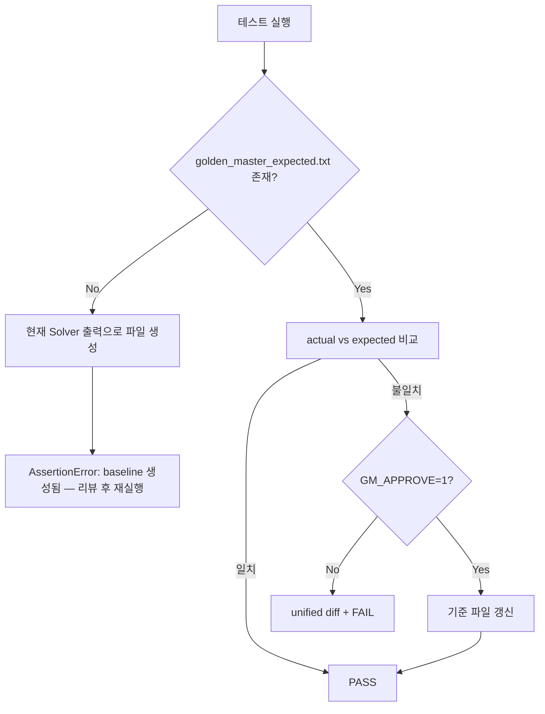

# Golden Master Approve Pattern — GM-1

Magic Square Solver의 **실제 Boundary 출력**을 기준선(baseline)으로 고정하고,
회귀 시 unified diff로 불일치를 드러내는 Approval / Golden Master 테스트 설계.

---

## 1. 목적

| 항목 | 내용 |
|---|---|
| 대상 | `magic_square.boundary.cli.solve()` 반환값 |
| 캡처 방식 | Result DTO 직렬화 (`list[int]` 성공 / `ValidationFailure` 실패) |
| 기준 파일 | `tests/golden_master_expected.txt` (버전 관리 필수) |
| 실패 시 | `difflib.unified_diff` 출력 후 `AssertionError` |

출력·검증·생성 책임 분리 원칙을 유지한다. Golden Master는 **표현 계층의 계약**만 검증하며,
Solver 내부 알고리즘을 직접 assert하지 않는다.

---

## 2. 시나리오 (5건)

| Section | Fixture | 기대 결과 |
|---|---|---|
| `[normal_success]` | `GRID_G1` | `[2,2,7,3,3,10]` — Step A (small-first) 성공 |
| `[reverse_success]` | `GRID_G2` | `[3,3,6,4,4,1]` — Step B (reverse) fallback 성공 |
| `[invalid_blank_count]` | `THREE_BLANK_GRID` | `E002` (INVALID_BLANK_COUNT) |
| `[duplicate_number]` | `DUPLICATE_NONZERO_GRID` | `E005` (DUPLICATE_NUMBER) |
| `[no_valid_solution]` | `UNSOLVABLE_GRID` | `UNSOLVABLE` (NO_VALID_MAGIC_SQUARE) |

`UNSOLVABLE_GRID`는 빈칸 2개·입력 검증 통과·두 배치 순서 모두 실패하는 전용 fixture다.

---

## 3. 기준 파일 구조

```
[section_name]
Input:
<4행 space-separated grid>
Output:
[r1,c1,n1,r2,c2,n2]
________________________________________
[section_name]
Input:
...
Error:
<CODE>
<message>
```

- 구분자: `________________________________________` (40 underscores)
- 성공 출력: 공백 없는 compact list (`[2,2,7,3,3,10]`)
- 실패 출력: PRD/Boundary 코드 + 메시지 2줄

---

## 4. Approve 패턴 동작



### 4.1 기준 파일 없음

1. `build_golden_master_document()`로 현재 출력 전체 생성
2. `tests/golden_master_expected.txt`에 기록
3. 첫 실행은 **의도적 FAIL** — baseline 리뷰 후 재실행

### 4.2 기준 파일 있음

1. 시나리오별 `capture_output()` 실행
2. 섹션 단위 또는 문서 전체 equality 비교
3. 불일치 → unified diff → `AssertionError`

### 4.3 Approve (기준 갱신)

```powershell
$env:GM_APPROVE = "1"
pytest -m golden_master -v
```

또는 생성 스크립트:

```powershell
python scripts/generate_golden_master.py
```

---

## 5. 파일 맵

| 파일 | 역할 |
|---|---|
| `tests/golden_master_expected.txt` | Golden Master baseline (SSOT) |
| `tests/golden_master/scenarios.py` | 시나리오 이름·입력 grid 정의 |
| `tests/golden_master/approve.py` | capture · parse · compare · approve |
| `scripts/generate_golden_master.py` | baseline 일괄 생성 CLI |
| `tests/boundary/test_golden_master_magic_square.py` | pytest 회귀 테스트 (GM-2, `@pytest.mark.golden_master`) |

---

## 6. 직렬화 규칙

```python
# 성공
solve(grid) -> list[int]
# → "[2,2,7,3,3,10]"

# 실패
solve(grid) -> ValidationFailure
# → "Error:\nE002\nExactly two blank cells (0) are required."
```

`capture_output()`은 stdout가 아닌 **DTO 직렬화**를 사용한다.
CLI/GUI 표현이 바뀌어도 Solver 계약(`solve()` 반환) 회귀를 독립적으로 잡을 수 있다.

---

## 7. 운영 가이드

1. Solver 또는 ValidationFailure 계약 변경 후 `pytest tests/boundary/test_gm_01_golden_master.py` 실행
2. diff 확인 → 의도된 변경이면 `python scripts/generate_golden_master.py`
3. `git add tests/golden_master_expected.txt` 후 커밋
4. CI에서는 `GM_APPROVE` 미설정 — mismatch 시 즉시 FAIL

---

## 8. Track A 위치

GM-1은 Boundary 출력 회귀 테스트로 `tests/boundary/test_gm_01_golden_master.py`에 둔다.
기존 U-OUT-01~03 단위 계약 테스트(G31~G33)를 **통합 스냅샷**으로 보완한다.
